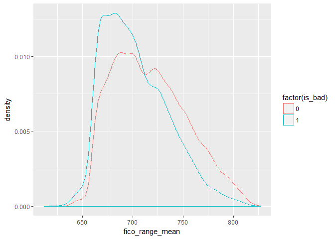
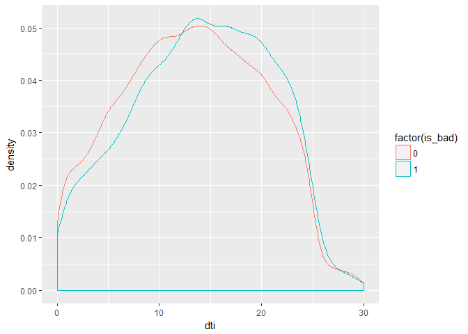
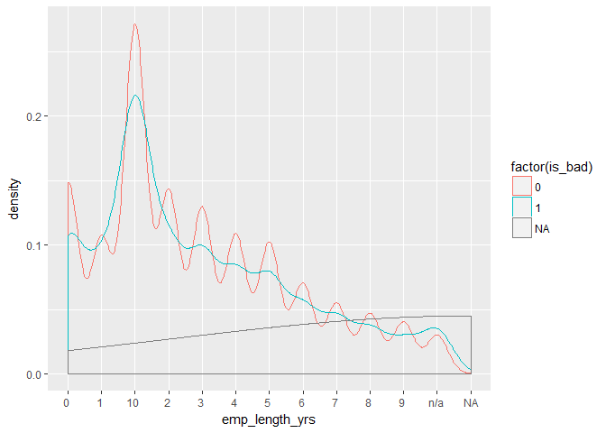
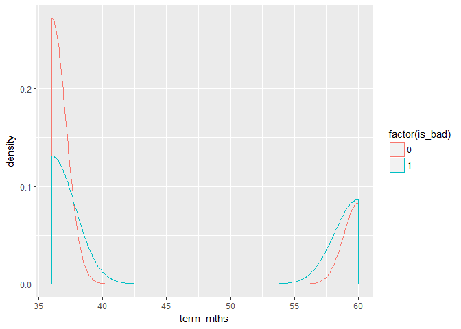
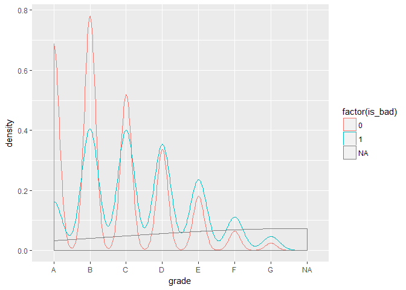
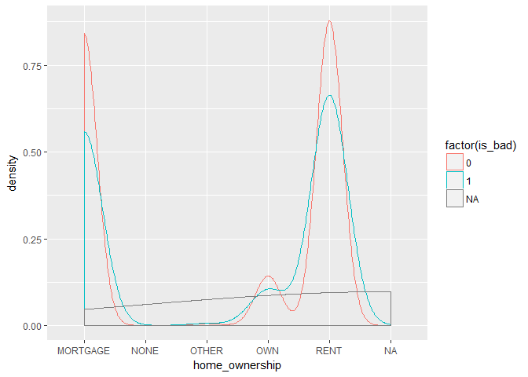
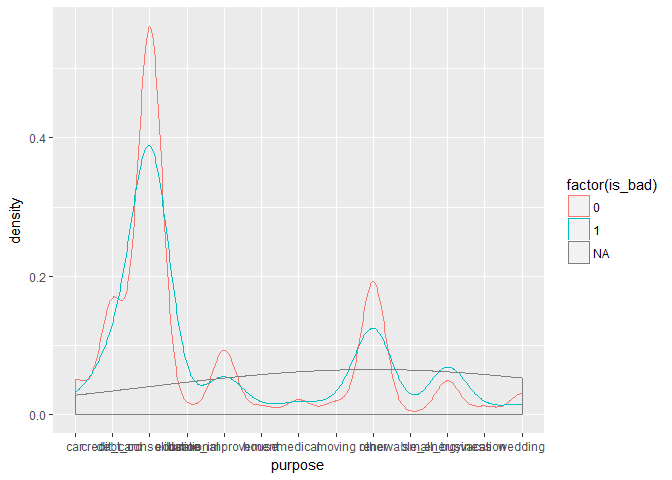

# Capstone Milestone Report
Paddy  
20 May 2017  


# Introduction 

## What is Lending Club
The client is Lending Club, an online credit marketplace that uses technology to offer more attractive loan terms than traditional banks, passing the savings on to borrowers in the form of lower interest rates and invetors in terms of solid returns.

Lending Club leverages online data and technology to quickly assess the risk of the application and if the customer is successful, determine the applicant's credit score and assign an appropriate interest rate. Like with any bank, if the applicant's risk is deemed to be too high, the loan is rejected. 

Lending Club offers a quick assessement and easier application than traditional banks and passes savings on to borrowers in terms of lower interest rates. For investors,  it provides risk adjusted returns by allowing for investment diversification across a range of loans varying in risk. 

Lending Club has grown from just over 100,000,000 dollars across 10,449 loans in 2010 to over 26.6 billion dollars worth of loans across over 2 million loans in quarter 1 of 2017. 

## The Problem 
One of Lending Club's biggest challenges is ensuring that repayments are made and trying to filter out delinquent/default loans through robust screening. As of June 2015, Lending Club's annual default rate across all grades was about 7%. A reduction in the default rate will reduce the risk of the loans being funded by investors making the investment more attractive. 

The goal of this project is to determine the key indicators and attributes of successful loans and hence create a model that offers a more robust screening process of applicants and hence reduce the overall percentage of default/delinquant loans. This will allow Lending Club to more accurately determine likely default loan applicants and hence achieve a lower default rate percentage on their loans. This reduced risk can be more attractive to investors and hence can increase the overall investment in Lending Club.


# The Datasets

2 datasets will be used for the purpose of this project:

  1. Approved Data - this contains 42,000 plus observations for loans that were issued between 2007 and 2011. The original data set on the Lending Club website did not include the FICO scores of the borrowers - a vital feature particularly in the comparative analysis with other data sets. A previous data set containing this information was obtained during the literature review. The following are the main features that will be used in the data set:
  
      * Amount requested
      * Term of loan - 36 or 60 months
      * Interest assigned to the loan - this is calculated by Lending Club after assessing the risk and determining a credit           rating.
      * Grade assigned to the loan - there are 7 different grades (A-G) varying depending on the loan risk
      * FICO score - this is a type of credit score and is used by lenders as an indicator of the risk of an application
      * Previous delinquency history
      * Debt-to-Income (DTI) ratio - total monthly debt repayment (excluding mortage repayments) divided by the monthly income.         A lower value is more desirable. 
      * Loan status - 7 indicators which show if if the loan has been complete, if its late, on track or default.This is a             vital feature to have for this analysis and will be very useful in the development of the predictive model.
      
  2. Rejected Data - this contains a massive 755,000 plus observations for loan applications that were rejected by Lending Club between 2007 and 2012. Although there is a significant number of observations there is less features available than with the Approved Data. The followinga are the Rejected Data features (which are all also used in the Approved Data):
  
      * Amount requested
      * Application date
      * Loan title
      * Risk score - FICO is used as the measurement for loan requests up until Nov-13. Since the data chosen is up to 2013,           FICO is the measure used and hence is comparable with the Approved Data set. 
      * DTI ratio
      * Zip code
      * State
      * Employment length
      * Policy code
      
## Data Limitations

The main limitations with the 2 data sets is the lack of common features. The Rejected Data set only has 9 features which can be compared to the Approved Data set. Features such as Previous Delinquency History, Days Delinquent and other variables that give a better insight into the applicants credit history would be useful for the Rejected Data set. Although Loan Title is included in both data sets, the lack of the Purpose feature will also be a limitation as this column has far fewer variables and hence can be easily grouped into a manageable number of observations for the comparative analysis. 

From the initial exploration of the available data, the following features will need to be analysed in greater detail and will be useful for the comparative analysis:

      * FICO
      * DTI
      * Amount
      * Employment length


## Data Wrangling and Cleaning 

The data sets were relatively comprehensive and well put together and hence did not require any major transformations. 

However, there were quite a few features that would not be required for the analysis, along with features that were made up primarily of NA values. Formatting was required on several columns as well as the application of One Hot Encoding which would aid the predictive model testing later in the project. 

The main libraries required for the data wrangling and cleaning were acquired when the relevant data set was imported. 


```r
library(tidyr)
library(dplyr)
library(readr)
LC_data <- read_csv("~/Springboard/Capstone project/LC data.csv")
```
The following shows the steps undertaken to transform the data into a desirable format suitable for the analysis.

### Deleting features
The first task was to delete any obvious columns that would not be of any benefit for the analysis. Once this was done, further investigation into each feature was carried out to determine the percentage of "NA" fields, deleting anything greater than 80% NA.  


```r
lc = LC_data
missing_values <- sapply(lc, function(x) {
  percentage <- sum(is.na(x))/length(x)
  percentage < 0.2
  })
lc <- lc[, missing_values == TRUE]
lc
```
Any features with only one unique value were also deleted from the data set, as these would not add any value to the analysis.


```r
unique_values2 <- sapply(lc, function(x) {
size <- length(unique(x[!is.na(x)]))
size > 1
   })
lc <- lc[, unique_values2 == TRUE]
```
### Formatting
The main formatting carried out on the data sets involved transforming variables from a character to a numberic format. This first involved removing any non numeric text/values such as "yrs", "months" and "%", "+" and ">" signs. The main variables that were formatted in this manner were interest rate, term, employment length and revolving utilisation.


```r
lc$term <- gsub("months", "", lc$term)
lc$term <- as.numeric(lc$term)
```
The issue date feature "issue_d" was also formatted from a "character" to a "date" to make it compatible with the date column from the rejected data. 

One of the most valuable features from this data set is "loan status". This categorises each loan into one of seven observations to represent the current status of the loan. For the purpose of the analysis, these status' were separated into 2 groups - good indicators that represent if a loan is still on track to be fully paid off without default or delay, and bad indicators which represent default or delay. These 2 indicator groups were then assigned a binary in the new column "bad_indicators". This will be very helpful in the analysis, particularly for the development of the predictive model.


```r
bad_indicators <- c("Late (16-30 days)", "Late (31-120 days)", "Default", "Charged Off")
lc$is_bad <- ifelse(lc$loan_status %in% bad_indicators, 1,
                    ifelse(lc$loan_status=="", NA,
                   0))
```
### Data normalisation and One Hot Encoding
In order to improve prediction accuracy in the predictive model, the FICO feature was normalised. The standardizing method was used as it allows for centre and scale to be specified in the code and hence, is easily transferable between different data sets (i.e. between approved and rejected data). 


```r
lc$fico_norm <- scale(lc$fico_range_mean, center = TRUE, scale = TRUE)
```
The final step in the data wrangling was to apply One Hot Encoding to features of paricular interest. The rule of thumb is that OHE can be applied to features of between 2 and 30 unique values. 


```r
library(ade4)

lc_OHE = lc
  ohe_feats = c('term_mths', 'grade', 'emp_length_yrs', 'home_ownership', 'verification_status',   'loan_status', 'pymnt_plan', 'purpose', 'delinq_2yrs', 'inq_last_6mths', 'pub_rec', 'pub_rec_bankruptcies')
for(f in ohe_feats) {
     df_dummy1 = acm.disjonctif(as.data.frame(as.factor(unlist(lc[f])))) 
     lc_OHE = cbind(lc_OHE, df_dummy1)

}
```

The addition of OHE is to facilitate the analysis and testing in the predictive modelling section of the project. For the purpose of the initial exploratory analysis and data visualisation, the original columns will be used. 


Similiar wrangling was carried out for the rejected loan data set. 

### Approved and Rejected Data - Combined Data Set
The 2 data sets were then combined using the union() function. Firstly, a "status" feature was added to both data sets, which was set to either "rejected" or "approved" depending on the data set. Just the relevant columns were selected from the approved data set, and the names of both columns were changed to allow for the columns to be joined together. 


```r
lc_comparison = lc
lc_comparison <- select(lc_comparison, emp_length_yrs, loan_amnt, issue_d, fico_range_mean, loan_status, dti)
lc_comparison <- lc_comparison  %>% mutate("Status" = "approved")
lc_comp <- union(lcr, lc_comparison)
```
To complete the combined data set wrangling, the FICO score was normalised as before with the approved data set. There was no need to specify the centre and scale as this encompasses all observations for both accepted and rejected loans. 


## Data Exploration
The purpose of the inital exploration was to gauge the relationship between the loan status and the remaining variables in the approved data set to determine if there are any factors that have more of an influence on the status of a loan than others. The objective of this was to take a selection of the more influencive variables in the data set to crudely determine the variables that could have the biggest impact on the success on the loan. 

Once determined, the focus of the further data visualisation and exploration will be to deep dive into these variables and determine how they interact with one another. 

The following are the variables to be investigated in this section:
      * fico_mean                       * grade                       
      * dti                             * home ownership
      * loan amnt                       * ann_income
      * emp length                      * inq. last 6 mths
      * term                            * revol_util
      * int rate                        * purpose

This will be done by plotting the density of 2 factors in is_bad (0/good/red and 1/bad/blue)) against each of the variables of interest. 
      
### Fico_mean
  

```r
#install.packages("readr")
#library(readr)
lc_cleaned <- read.csv("~/Springboard/Capstone project/New folder/lc_cleaned.csv")

lc = lc_cleaned


library(ggplot2)

p <- ggplot(lc, aes(x = fico_range_mean, group = is_bad, color = factor(is_bad))) + geom_density()
p
```

<!-- -->
As expected there is a difference between the 2 status' for this variable which suggests that a higher FICO score is more desirable with higher rates of defaulted loans witnessed in lower FICO ranges.

### DTI
<!-- -->
DTI is quite evenly spread however there is a slight tendency of higher DTI's to result in more bad loans hence confirming that the lower the DTI value the more likely the loan is to be successfully paid off. It is worth looking into further. 

### Loan Amount
<!-- -->
Apart from loans of smaller amounts having more of a success of being fully paid off, the spread is quite even along the graph and does not suggest much of a relationship between the chance of failure and success.

### Employment length
<!-- -->
Similar to Loan Amount, apart from 10 plus years of employment, there is no stark difference between the 2 observations. 

### Term
<!-- -->
Interestingly, the shorter the term, the more likely the loan is to succeed. This is definitely worth looking into further. 

### Interest Rate
<!-- -->
Similar to DTI, it would be expected that the lower the interest rate on the loan, the greater the chance of success as the interest rate is assigned based on the risk of the loan which is derived from the applicant's credit history. 

### Grade
<!-- -->
Grade appears to be similar to the interest rate in the fact that the grades which are deemed to be less risky are less likely to default i.e. A-grades are less likely to default while G-grades are more likely to default. It may be worth looking at the relationship between grade and interest rate later in the data exploration to determine the correlation between the two. 

### Home Ownership
<!-- -->
The two main observations in "home_ownership" are "rent" and "mortgage". The expectation would be that home owners would be more likely to repay their loans (which is the case) while renters would be more likely to default (which is not the case). There is not as much of a difference between the 2 of these observations as expected.  

### Annual Income
<!-- -->
There appears to be a consistent correlation between incomes for good and bad loans hence, this will not be investigated further.  

### Inquiries in the last 6 months
<!-- -->
This graph shows that if the applicant has 0 inquiries they have a better chance of a good loan. There is a relatively consistent trend after this where there is not a major difference between the number of inquiries and the success of the loan.

### Revolution util
<!-- -->
There is a very clear difference here between good and bad loans. The graph suggests that the lower the Revol Util, the better chance of successfully repaying the loan. 

### Purpose
<!-- -->
There are 4 main peaks in the graph with significant differences between the good and bad loan status. This will be looked at in more detail to determine what purpose of the loan results in a greater risk. 

## Approach

The inital exploration has been useful to understand the interesting trends in the data and to give an indication of what will be worth exploring in more detail. The the main goal of the project remains the same as when it was discussed in the Capstone proposal - to create a predictive model which can improve the screening process for loan applicants in order to reduce the risk to investors.

The following is the approach for the project:

  * Screening Process - determination of the vital factors in approving the applicant for a loan. For the purpose of this section, the combined data set (approved and rejected) will be analysed to determine the attributes necessary to get approved for a loan and how these differ to getting rejected.
    
  * Loan Success - determination of the most influential applicant attributes that will result in a sucessful loan. This will be done by diving deeper into the features described in section 3 (preliminary exploration) that have shown interesting trends. 
  
  * Predictive model - develop a predictive model that will better screen the applicants and ultimately improve the overall percentage of successful loans to bad loans. 
  
  
  
