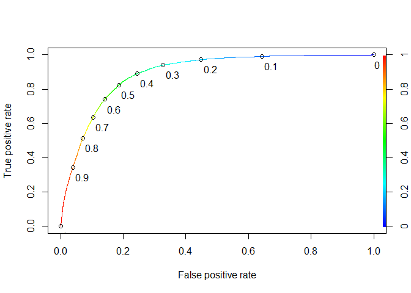
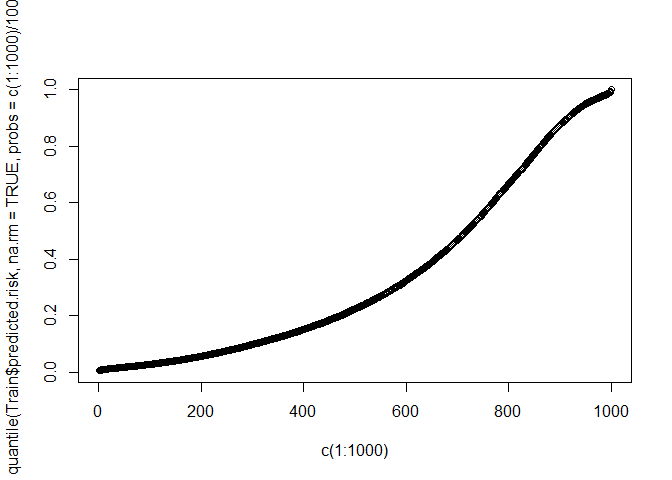
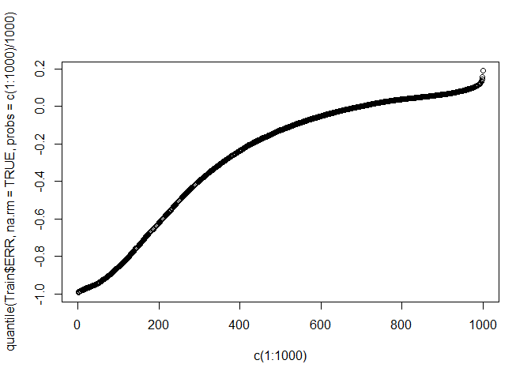
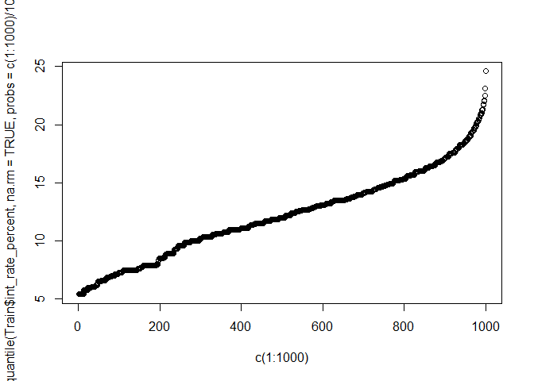
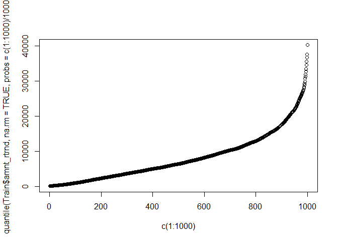
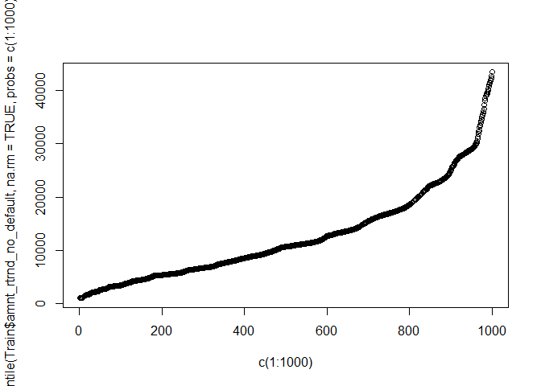

# Capstone Milestone Report
Paddy  
20 May 2017  


# Introduction  

## What is Lending Club
The client is Lending Club, an online credit marketplace that uses technology to offer more attractive loan terms than traditional banks, passing the savings on to borrowers in the form of lower interest rates and invetors in terms of solid returns.

Lending Club leverages online data and technology to quickly assess the risk of the application and if the customer is successful, determine the applicant's credit score and assign an appropriate interest rate. Like with any bank, if the applicant's risk is deemed to be too high, the loan is rejected. 

Lending Club offers a quick assessement and easier application than traditional banks and passes savings on to borrowers in terms of lower interest rates. For investors,  it provides risk adjusted returns by allowing for investment diversification across a range of loans varying in risk. 

Lending Club has grown from just over 100,000,000 dollars across 10,449 loans in 2010 to over 26.6 billion dollars worth of loans across over 2 million loans in quarter 1 of 2017. 

## The Problem 
One of Lending Club's biggest challenges is ensuring that repayments are made and trying to filter out delinquent/default loans through robust screening. As of June 2015, Lending Club's annual default rate across all grades was about 7%. A reduction in the default rate will reduce the risk of the loans being funded by investors making the investment more attractive. 

The goal of this project is to determine the key indicators and attributes of successful loans and hence create a model that offers a more robust screening process of applicants and hence reduce the overall percentage of default/delinquant loans. This will allow Lending Club to more accurately determine likely default loan applicants and hence achieve a lower default rate percentage on their loans. This reduced risk can be more attractive to investors and hence can increase the overall investment in Lending Club.


# The Datasets

2 datasets will be used for the purpose of this project:

  1. Approved Data - this contains 42,000 plus observations for loans that were issued between 2007 and 2011. The original data set on the Lending Club website did not include the FICO scores of the borrowers - a vital feature particularly in the comparative analysis with other data sets. A previous data set containing this information was obtained during the literature review. The following are the main features that will be used in the data set:
  
      * Amount requested
      * Term of loan - 36 or 60 months
      * Interest assigned to the loan - this is calculated by Lending Club after assessing the risk and determining a credit           rating.
      * Grade assigned to the loan - there are 7 different grades (A-G) varying depending on the loan risk
      * FICO score - this is a type of credit score and is used by lenders as an indicator of the risk of an application
      * Previous delinquency history
      * Debt-to-Income (DTI) ratio - total monthly debt repayment (excluding mortage repayments) divided by the monthly income.         A lower value is more desirable. 
      * Loan status - 7 indicators which show if if the loan has been complete, if its late, on track or default.This is a             vital feature to have for this analysis and will be very useful in the development of the predictive model.
      
  2. Rejected Data - this contains a massive 755,000 plus observations for loan applications that were rejected by Lending Club between 2007 and 2012. Although there is a significant number of observations there is less features available than with the Approved Data. The followinga are the Rejected Data features (which are all also used in the Approved Data):
  
      * Amount requested
      * Application date
      * Loan title
      * Risk score - FICO is used as the measurement for loan requests up until Nov-13. Since the data chosen is up to 2013,           FICO is the measure used and hence is comparable with the Approved Data set. 
      * DTI ratio
      * Zip code
      * State
      * Employment length
      * Policy code
      
## Data Limitations

The main limitations with the 2 data sets is the lack of common features. The Rejected Data set only has 9 features which can be compared to the Approved Data set. Features such as Previous Delinquency History, Days Delinquent and other variables that give a better insight into the applicants credit history would be useful for the Rejected Data set. Although Loan Title is included in both data sets, the lack of the Purpose feature will also be a limitation as this column has far fewer variables and hence can be easily grouped into a manageable number of observations for the comparative analysis. 

From the initial exploration of the available data, the following features will need to be analysed in greater detail and will be useful for the comparative analysis:

      * FICO
      * DTI
      * Amount
      * Employment length


## Data Wrangling and Cleaning 

The data sets were relatively comprehensive and well put together and hence did not require any major transformations. 

However, there were quite a few features that would not be required for the analysis, along with features that were made up primarily of NA values. Formatting was required on several columns as well as the application of One Hot Encoding which would aid the predictive model testing later in the project. 

The main libraries required for the data wrangling and cleaning were acquired when the relevant data set was imported. 


```r
library(tidyr)
library(dplyr)
library(readr)
LC_data <- read_csv("~/Springboard/Capstone project/LC data.csv")
```
The following shows the steps undertaken to transform the data into a desirable format suitable for the analysis.

### Deleting features
The first task was to delete any obvious columns that would not be of any benefit for the analysis. Once this was done, further investigation into each feature was carried out to determine the percentage of "NA" fields, deleting anything greater than 80% NA.  


```r
lc = LC_data
missing_values <- sapply(lc, function(x) {
  percentage <- sum(is.na(x))/length(x)
  percentage < 0.2
  })
lc <- lc[, missing_values == TRUE]
lc
```
Any features with only one unique value were also deleted from the data set, as these would not add any value to the analysis.


```r
unique_values2 <- sapply(lc, function(x) {
size <- length(unique(x[!is.na(x)]))
size > 1
   })
lc <- lc[, unique_values2 == TRUE]
```
### Formatting
The main formatting carried out on the data sets involved transforming variables from a character to a numberic format. This first involved removing any non numeric text/values such as "yrs", "months" and "%", "+" and ">" signs. The main variables that were formatted in this manner were interest rate, term, employment length and revolving utilisation.


```r
lc$term <- gsub("months", "", lc$term)
lc$term <- as.numeric(lc$term)
```
The issue date feature "issue_d" was also formatted from a "character" to a "date" to make it compatible with the date column from the rejected data. 

One of the most valuable features from this data set is "loan status". This categorises each loan into one of seven observations to represent the current status of the loan. For the purpose of the analysis, these status' were separated into 2 groups - good indicators that represent if a loan is still on track to be fully paid off without default or delay, and bad indicators which represent default or delay. These 2 indicator groups were then assigned a binary in the new column "bad_indicators". This will be very helpful in the analysis, particularly for the development of the predictive model.


```r
bad_indicators <- c("Late (16-30 days)", "Late (31-120 days)", "Default", "Charged Off")
lc$is_bad <- ifelse(lc$loan_status %in% bad_indicators, 1,
                    ifelse(lc$loan_status=="", NA,
                   0))
```
### Data normalisation and One Hot Encoding
In order to improve prediction accuracy in the predictive model, the FICO feature was normalised. The standardizing method was used as it allows for centre and scale to be specified in the code and hence, is easily transferable between different data sets (i.e. between approved and rejected data). 


```r
lc$fico_norm <- scale(lc$fico_range_mean, center = TRUE, scale = TRUE)
```
The final step in the data wrangling was to apply One Hot Encoding to features of paricular interest. The rule of thumb is that OHE can be applied to features of between 2 and 30 unique values. 


```r
library(ade4)

lc_OHE = lc
  ohe_feats = c('term', 'grade', 'emp_length_yrs', 'home_ownership', 'verification_status',   'loan_status', 'pymnt_plan', 'purpose', 'delinq_2yrs', 'inq_last_6mths', 'pub_rec', 'pub_rec_bankruptcies')
for(f in ohe_feats) {
     df_dummy1 = acm.disjonctif(as.data.frame(as.factor(unlist(lc[f])))) 
     lc_OHE = cbind(lc_OHE, df_dummy1)

}
```

The addition of OHE is to facilitate the analysis and testing in the predictive modelling section of the project. For the purpose of the initial exploratory analysis and data visualisation, the original columns will be used. 


Similiar wrangling was carried out for the rejected loan data set. 

### Approved and Rejected Data - Combined Data Set
The 2 data sets were then combined using the union() function. Firstly, a "status" feature was added to both data sets, which was set to either "rejected" or "approved" depending on the data set. Just the relevant columns were selected from the approved data set, and the names of both columns were changed to allow for the columns to be joined together. 


```r
lc_comparison = lc
lc_comparison <- select(lc_comparison, emp_length_yrs, loan_amnt, issue_d, fico_range_mean, loan_status, dti)
lc_comparison <- lc_comparison  %>% mutate("Status" = "approved")
lc_comp <- union(lcr, lc_comparison)
```
To complete the combined data set wrangling, the FICO score was normalised as before with the approved data set. There was no need to specify the centre and scale as this encompasses all observations for both accepted and rejected loans. 


# Data Exploration
The purpose of the inital exploration was to gauge the relationship between the loan status and the remaining variables in the approved data set to determine if there are any factors that have more of an influence on the status of a loan than others. The objective of this was to take a selection of the more influencive variables in the data set to crudely determine the variables that could have the biggest impact on the success on the loan. 

Once determined, the focus of the further data visualisation and exploration will be to deep dive into these variables and determine how they interact with one another. 

The following are the variables to be investigated in this section:
      * fico_mean                       * grade                       
      * dti                             * home ownership
      * loan amnt                       * ann_income
      * emp length                      * inq. last 6 mths
      * term                            * revol_util
      * int rate                        * purpose

This will be done by plotting the density of 2 factors in is_bad (0/good/red and 1/bad/blue)) against each of the variables of interest. 
      
### Fico_mean
  
<!-- -->

As expected there is a difference between the 2 status' for this variable which suggests that a higher FICO score is more desirable with higher rates of defaulted loans witnessed in lower FICO ranges.

### DTI
<!-- -->

DTI is quite evenly spread however there is a slight tendency of higher DTI's to result in more bad loans hence confirming that the lower the DTI value the more likely the loan is to be successfully paid off. It is worth looking into further. 

### Loan Amount
<!-- -->

Apart from loans of smaller amounts having more of a success of being fully paid off, the spread is quite even along the graph and does not suggest much of a relationship between the chance of failure and success.

### Employment length
<!-- -->

Similar to Loan Amount, apart from 10 plus years of employment, there is no stark difference between the 2 observations. 

### Term
<!-- -->

Interestingly, the shorter the term, the more likely the loan is to succeed. This is definitely worth looking into further. 

### Interest Rate
<!-- -->

Similar to DTI, it would be expected that the lower the interest rate on the loan, the greater the chance of success as the interest rate is assigned based on the risk of the loan which is derived from the applicant's credit history. 

### Grade
<!-- -->

Grade appears to be similar to the interest rate in the fact that the grades which are deemed to be less risky are less likely to default i.e. A-grades are less likely to default while G-grades are more likely to default. It may be worth looking at the relationship between grade and interest rate later in the data exploration to determine the correlation between the two. 

### Home Ownership
<!-- -->

The two main observations in "home_ownership" are "rent" and "mortgage". The expectation would be that home owners would be more likely to repay their loans (which is the case) while renters would be more likely to default (which is not the case). There is not as much of a difference between the 2 of these observations as expected.  

### Annual Income
<!-- -->

There appears to be a consistent correlation between incomes for good and bad loans hence, this will not be investigated further.  

### Inquiries in the last 6 months
<!-- -->

This graph shows that if the applicant has 0 inquiries they have a better chance of a good loan. There is a relatively consistent trend after this where there is not a major difference between the number of inquiries and the success of the loan.

### Revolution util
<!-- -->

There is a very clear difference here between good and bad loans. The graph suggests that the lower the Revol Util, the better chance of successfully repaying the loan. 

### Purpose
<!-- -->

There are 4 main peaks in the graph with significant differences between the good and bad loan status. This will be looked at in more detail to determine what particular loan purposes result in a greater risk. 


Overall, the inital data exploration and visulatisation demonstrates that there are significant variables that contribute to a loan being good or bad. FICO, employment length, interest rate, loan term, grade and purpose all show a strong relationship with the loan status as they demostrate a significant difference between the good and bad indicators of the loan status. These variables need to be investigated further.   
_________________________________


# Data Analysis
For the purpose of this section, machine learning will be used to build a model which can then be used to demostrate the contributions of the variables described in the Data Exploration section even further.

I will be using the "lc_formatted" dataset as described in the Data Wrangling section. This dataset does not include the One Hot Encoding exercise that was carried out on the data. This may have been useful if a significant amount of variables were being used for the machine learning however for the purpose of the logistic regression, I will be selecting the variables that will be used. Logistic regression will format the variables as required. For example, "Purpose" will be automatically separated to show the signifiance of each individual loan purpose such as education, small business etc. 


```
## 
## Attaching package: 'dplyr'
```

```
## The following objects are masked from 'package:stats':
## 
##     filter, lag
```

```
## The following objects are masked from 'package:base':
## 
##     intersect, setdiff, setequal, union
```

```
## Parsed with column specification:
## cols(
##   .default = col_integer(),
##   term_mths = col_character(),
##   int_rate_percent = col_double(),
##   installment = col_double(),
##   grade = col_character(),
##   emp_length_yrs = col_character(),
##   home_ownership = col_character(),
##   annual_inc = col_double(),
##   verification_status = col_character(),
##   issue_d = col_date(format = ""),
##   loan_status = col_character(),
##   pymnt_plan = col_character(),
##   purpose = col_character(),
##   addr_state = col_character(),
##   dti = col_double(),
##   earliest_cr_line = col_character(),
##   revol_util = col_double(),
##   total_pymnt = col_double(),
##   total_pymnt_inv = col_double(),
##   total_rec_prncp = col_double(),
##   total_rec_int = col_double()
##   # ... with 7 more columns
## )
```

```
## See spec(...) for full column specifications.
```

## Further formatting - Variables not required

For the date columns to be useful, they need to be binned into quarters or even months so that trends can be investigated in groups rather than on particular days. For this analysis, the date columns will not be investigated, however future work could investigate correlations between default rate and loans issued on certain dates for example. Hence, columns "issue date", "last_pymnt_d", "last_credit_pull_d" etc will be omitted from the regression in this instance. 

Address will also not be required for the purpose of this analysis so this will also be removed from the data set. 


## Logistic Regression

The initial logistic regression to be carried out is to gain a better insight into the default rates of loans. The probability of default will be calculated for each loan which will allow for further analysis in terms of determining the true return on investment of a loan (when the default is taken into account as well as the interest rate). This will allow for a more robust portfolio for investors and hence a better overall return on investment.  


The dependent variable which will be used for the inital logistic regression analysis is "is_bad", the variable which tells us whether or not the loan has defaulted. "1" means the loan has defaulted while "0" means the loan has been successfully paid off. The independent variables will be added around this dependent variable and re-iterated until a successful model has been created.

Once the model has been built, the "Test" dataset will be used for its evalution. 


### Step 1 - Get the Baseline 
Predict the most frequent outcome (i.e. default loan or complete loan) of all observations. This is done by counting the actual number of default loans vs the number of complete loans to give the accuracy of the dataset. 


          0      1
---  ------  -----
0     36103      0
1         0   6432
This produces the following table. The use of the sign function can derive a smarter baseline however in this case, both tables (actual results and smart baseline) derive the same accuracy of 84.88%.

Looking at the table and results however, the baseline of 84.88% is quite high due to the fact that the majority of cases are 0. To make the prediction more insightful, the data will be undersampled in Traind_under. This will comprise 50% 0 values and 50% 1 values. This way the baseline accuracy will be 50%. This will give the prediction based on the model built alot more value.
  

## Step 2 - Split the data 
Using CaTools package, split the data into 2 sections - test data and train data. The ratio for the divide will be 80/20 i.e. 80% of the dataset will be made up of train data "Train" and the remaining 20% will be test data "Test".


Train data is the data set based on the original lc2 data. Alongside this data set, Train_under will also be used as this will give a clearer indication of the accuracy of the model that is built for reasons discussed in step 1. Train_under will be used to refine the model which will be derived from the Train data set.

## Step 3 - Run logistic regression on the model

Model1 will take into account all variables apart from member id and loan status. The idea is to start with the majority of the variables and gradually narrow down until only the significant variables are included in the model.

### Model 1

```
## 
## Call:
## glm(formula = is_bad ~ . - id - loan_status, family = "binomial", 
##     data = Train)
## 
## Deviance Residuals: 
##     Min       1Q   Median       3Q      Max  
## -2.4765  -0.0424  -0.0086  -0.0001   8.4904  
## 
## Coefficients: (6 not defined because of singularities)
##                                      Estimate Std. Error z value Pr(>|z|)
## (Intercept)                        -4.924e+00  7.513e+00  -0.655 0.512213
## loan_amnt                           3.403e-04  4.206e-05   8.092 5.86e-16
## term_mths60 months                  4.692e+00  3.834e-01  12.240  < 2e-16
## int_rate_percent                   -3.055e-01  1.202e-01  -2.541 0.011042
## installment                         1.187e-01  5.935e-03  19.997  < 2e-16
## gradeB                              1.386e+00  5.542e-01   2.500 0.012412
## gradeC                              1.042e+00  8.187e-01   1.273 0.203006
## gradeD                              1.008e+00  1.038e+00   0.970 0.331883
## gradeE                             -6.466e-01  1.293e+00  -0.500 0.617146
## gradeF                             -2.971e+00  1.733e+00  -1.714 0.086500
## gradeG                             -3.258e+00  1.728e+00  -1.886 0.059342
## emp_length_yrs1                     1.363e-01  4.650e-01   0.293 0.769375
## emp_length_yrs10                    2.797e-01  3.772e-01   0.742 0.458293
## emp_length_yrs2                     1.371e-01  4.196e-01   0.327 0.743891
## emp_length_yrs3                     4.001e-01  4.185e-01   0.956 0.338981
## emp_length_yrs4                    -2.110e-02  4.758e-01  -0.044 0.964633
## emp_length_yrs5                    -7.433e-01  5.907e-01  -1.258 0.208249
## emp_length_yrs6                    -3.656e-01  5.802e-01  -0.630 0.528585
## emp_length_yrs7                     4.719e-01  5.530e-01   0.853 0.393522
## emp_length_yrs8                     3.165e-01  6.096e-01   0.519 0.603629
## emp_length_yrs9                    -1.630e+00  1.445e+00  -1.128 0.259163
## emp_length_yrsn/a                   7.237e-01  4.939e-01   1.465 0.142897
## home_ownershipOTHER                 6.651e-01  1.097e+00   0.606 0.544405
## home_ownershipRENT                 -1.241e-01  2.290e-01  -0.542 0.587993
## annual_inc                         -1.510e-05  4.418e-06  -3.417 0.000634
## verification_statusSource Verified -3.605e-02  2.670e-01  -0.135 0.892588
## verification_statusVerified        -1.999e-01  3.015e-01  -0.663 0.507331
## issue_d                             7.387e-05  4.005e-04   0.184 0.853673
## pymnt_plany                        -5.329e+00  3.561e+05   0.000 0.999988
## purposecredit_card                  4.085e-01  6.259e-01   0.653 0.513958
## purposedebt_consolidation           3.067e-01  5.488e-01   0.559 0.576275
## purposeeducational                  7.440e-01  9.277e-01   0.802 0.422550
## purposehome_improvement             9.032e-01  6.276e-01   1.439 0.150113
## purposehouse                       -6.606e+00  1.199e+01  -0.551 0.581773
## purposemedical                      8.721e-01  7.061e-01   1.235 0.216774
## purposemoving                      -2.279e-01  9.554e-01  -0.239 0.811490
## purposeother                        5.096e-01  5.466e-01   0.932 0.351211
## purposerenewable_energy             1.096e+00  1.213e+00   0.904 0.365899
## purposesmall_business               1.099e+00  6.941e-01   1.584 0.113249
## purposevacation                     5.238e-01  8.070e-01   0.649 0.516352
## purposewedding                      1.104e+00  8.542e-01   1.293 0.196146
## dti                                -1.280e-02  1.693e-02  -0.756 0.449655
## delinq_2yrs                         1.949e-02  1.743e-01   0.112 0.910958
## fico_range_low                      1.182e-02  5.551e-03   2.129 0.033275
## fico_range_high                            NA         NA      NA       NA
## inq_last_6mths                     -1.136e-01  8.575e-02  -1.325 0.185042
## open_acc                            1.425e-02  3.371e-02   0.423 0.672396
## pub_rec                             3.940e-01  4.998e-01   0.788 0.430503
## revol_bal                          -1.757e-05  8.719e-06  -2.015 0.043914
## revol_util                          5.995e-03  4.521e-03   1.326 0.184816
## total_acc                           2.779e-02  1.381e-02   2.012 0.044242
## total_pymnt                         3.464e+01  4.130e+01   0.839 0.401645
## total_pymnt_inv                    -1.615e-04  7.616e-05  -2.120 0.033981
## total_rec_prncp                    -3.465e+01  4.130e+01  -0.839 0.401580
## total_rec_int                      -3.464e+01  4.130e+01  -0.839 0.401671
## total_rec_late_fee                 -3.462e+01  4.130e+01  -0.838 0.401877
## recoveries                         -3.239e+01  4.725e+01  -0.686 0.493013
## collection_recovery_fee             4.727e+01  2.136e+03   0.022 0.982340
## last_pymnt_amnt                    -3.169e-05  1.030e-04  -0.308 0.758326
## last_fico_range_high               -7.130e-03  1.556e-03  -4.582 4.61e-06
## last_fico_range_low                -3.711e-04  1.087e-03  -0.341 0.732800
## acc_now_delinq                             NA         NA      NA       NA
## delinq_amnt                                NA         NA      NA       NA
## pub_rec_bankruptcies               -2.479e-01  6.221e-01  -0.399 0.690199
## tax_liens                                  NA         NA      NA       NA
## meet_cred_pol                      -1.208e+00  4.856e-01  -2.489 0.012825
## fico_range_mean                            NA         NA      NA       NA
## fico_norm                                  NA         NA      NA       NA
##                                       
## (Intercept)                           
## loan_amnt                          ***
## term_mths60 months                 ***
## int_rate_percent                   *  
## installment                        ***
## gradeB                             *  
## gradeC                                
## gradeD                                
## gradeE                                
## gradeF                             .  
## gradeG                             .  
## emp_length_yrs1                       
## emp_length_yrs10                      
## emp_length_yrs2                       
## emp_length_yrs3                       
## emp_length_yrs4                       
## emp_length_yrs5                       
## emp_length_yrs6                       
## emp_length_yrs7                       
## emp_length_yrs8                       
## emp_length_yrs9                       
## emp_length_yrsn/a                     
## home_ownershipOTHER                   
## home_ownershipRENT                    
## annual_inc                         ***
## verification_statusSource Verified    
## verification_statusVerified           
## issue_d                               
## pymnt_plany                           
## purposecredit_card                    
## purposedebt_consolidation             
## purposeeducational                    
## purposehome_improvement               
## purposehouse                          
## purposemedical                        
## purposemoving                         
## purposeother                          
## purposerenewable_energy               
## purposesmall_business                 
## purposevacation                       
## purposewedding                        
## dti                                   
## delinq_2yrs                           
## fico_range_low                     *  
## fico_range_high                       
## inq_last_6mths                        
## open_acc                              
## pub_rec                               
## revol_bal                          *  
## revol_util                            
## total_acc                          *  
## total_pymnt                           
## total_pymnt_inv                    *  
## total_rec_prncp                       
## total_rec_int                         
## total_rec_late_fee                    
## recoveries                            
## collection_recovery_fee               
## last_pymnt_amnt                       
## last_fico_range_high               ***
## last_fico_range_low                   
## acc_now_delinq                        
## delinq_amnt                           
## pub_rec_bankruptcies                  
## tax_liens                             
## meet_cred_pol                      *  
## fico_range_mean                       
## fico_norm                             
## ---
## Signif. codes:  0 '***' 0.001 '**' 0.01 '*' 0.05 '.' 0.1 ' ' 1
## 
## (Dispersion parameter for binomial family taken to be 1)
## 
##     Null deviance: 27540.26  on 32871  degrees of freedom
## Residual deviance:   901.72  on 32810  degrees of freedom
##   (1156 observations deleted due to missingness)
## AIC: 1025.7
## 
## Number of Fisher Scoring iterations: 25
```

Model1 gave several significant values however it did not converge hence the next step is to take just the significant values and run the regression model again until all values in the model are significant.

### Model 2

```
## 
## Call:
## glm(formula = is_bad ~ loan_amnt + term_mths + int_rate_percent + 
##     installment + grade + annual_inc + total_acc + last_fico_range_high + 
##     meet_cred_pol + fico_norm, family = "binomial", data = Train)
## 
## Deviance Residuals: 
##     Min       1Q   Median       3Q      Max  
## -4.9727  -0.4545  -0.2701  -0.1414   3.5668  
## 
## Coefficients:
##                        Estimate Std. Error z value Pr(>|z|)    
## (Intercept)           1.075e+01  2.283e-01  47.111  < 2e-16 ***
## loan_amnt             2.173e-05  9.437e-06   2.303 0.021272 *  
## term_mths60 months    5.229e-01  6.818e-02   7.669 1.73e-14 ***
## int_rate_percent      2.274e-02  1.761e-02   1.291 0.196562    
## installment           7.257e-05  3.253e-04   0.223 0.823473    
## gradeB                2.790e-01  9.022e-02   3.092 0.001989 ** 
## gradeC                3.762e-01  1.255e-01   2.998 0.002721 ** 
## gradeD                5.359e-01  1.586e-01   3.380 0.000726 ***
## gradeE                4.924e-01  1.894e-01   2.600 0.009328 ** 
## gradeF                7.586e-01  2.278e-01   3.330 0.000868 ***
## gradeG                8.233e-01  2.655e-01   3.100 0.001933 ** 
## annual_inc           -4.169e-06  5.158e-07  -8.083 6.33e-16 ***
## total_acc             1.084e-02  1.706e-03   6.356 2.07e-10 ***
## last_fico_range_high -1.991e-02  2.785e-04 -71.512  < 2e-16 ***
## meet_cred_pol        -5.166e-01  6.825e-02  -7.570 3.74e-14 ***
## fico_norm             1.993e-01  3.645e-02   5.469 4.51e-08 ***
## ---
## Signif. codes:  0 '***' 0.001 '**' 0.01 '*' 0.05 '.' 0.1 ' ' 1
## 
## (Dispersion parameter for binomial family taken to be 1)
## 
##     Null deviance: 28898  on 34003  degrees of freedom
## Residual deviance: 19890  on 33988  degrees of freedom
##   (24 observations deleted due to missingness)
## AIC: 19922
## 
## Number of Fisher Scoring iterations: 6
```

### Model 3

```
## 
## Call:
## glm(formula = is_bad ~ loan_amnt + term_mths + int_rate_percent + 
##     grade + annual_inc + total_acc + last_fico_range_high + meet_cred_pol + 
##     fico_norm, family = "binomial", data = Train)
## 
## Deviance Residuals: 
##     Min       1Q   Median       3Q      Max  
## -4.9730  -0.4542  -0.2700  -0.1414   3.5658  
## 
## Coefficients:
##                        Estimate Std. Error z value Pr(>|z|)    
## (Intercept)           1.075e+01  2.278e-01  47.206  < 2e-16 ***
## loan_amnt             2.371e-05  3.222e-06   7.360 1.84e-13 ***
## term_mths60 months    5.126e-01  5.031e-02  10.189  < 2e-16 ***
## int_rate_percent      2.319e-02  1.749e-02   1.326 0.184931    
## gradeB                2.790e-01  9.023e-02   3.093 0.001984 ** 
## gradeC                3.762e-01  1.255e-01   2.997 0.002723 ** 
## gradeD                5.365e-01  1.585e-01   3.384 0.000715 ***
## gradeE                4.929e-01  1.894e-01   2.602 0.009256 ** 
## gradeF                7.594e-01  2.278e-01   3.334 0.000856 ***
## gradeG                8.251e-01  2.654e-01   3.109 0.001880 ** 
## annual_inc           -4.164e-06  5.152e-07  -8.082 6.36e-16 ***
## total_acc             1.085e-02  1.705e-03   6.362 1.99e-10 ***
## last_fico_range_high -1.991e-02  2.784e-04 -71.522  < 2e-16 ***
## meet_cred_pol        -5.161e-01  6.820e-02  -7.567 3.83e-14 ***
## fico_norm             1.995e-01  3.644e-02   5.476 4.35e-08 ***
## ---
## Signif. codes:  0 '***' 0.001 '**' 0.01 '*' 0.05 '.' 0.1 ' ' 1
## 
## (Dispersion parameter for binomial family taken to be 1)
## 
##     Null deviance: 28898  on 34003  degrees of freedom
## Residual deviance: 19890  on 33989  degrees of freedom
##   (24 observations deleted due to missingness)
## AIC: 19920
## 
## Number of Fisher Scoring iterations: 6
```

### Model 4

```
## 
## Call:
## glm(formula = is_bad ~ loan_amnt + term_mths + purpose + int_rate_percent + 
##     grade + annual_inc + total_acc + last_fico_range_high + meet_cred_pol + 
##     fico_norm, family = "binomial", data = Train)
## 
## Deviance Residuals: 
##     Min       1Q   Median       3Q      Max  
## -4.9423  -0.4512  -0.2678  -0.1392   3.5761  
## 
## Coefficients:
##                             Estimate Std. Error z value Pr(>|z|)    
## (Intercept)                1.071e+01  2.500e-01  42.816  < 2e-16 ***
## loan_amnt                  2.369e-05  3.357e-06   7.057 1.70e-12 ***
## term_mths60 months         5.532e-01  5.076e-02  10.899  < 2e-16 ***
## purposecredit_card        -6.349e-02  1.211e-01  -0.524  0.60005    
## purposedebt_consolidation  4.718e-02  1.103e-01   0.428  0.66873    
## purposeeducational         4.519e-01  1.974e-01   2.290  0.02204 *  
## purposehome_improvement   -1.286e-02  1.279e-01  -0.101  0.91988    
## purposehouse              -5.299e-02  2.132e-01  -0.249  0.80369    
## purposemedical             9.608e-02  1.706e-01   0.563  0.57342    
## purposemoving              3.567e-02  1.798e-01   0.198  0.84277    
## purposeother               3.367e-02  1.153e-01   0.292  0.77030    
## purposerenewable_energy    3.604e-03  3.829e-01   0.009  0.99249    
## purposesmall_business      6.867e-01  1.290e-01   5.324 1.02e-07 ***
## purposevacation            3.400e-02  2.125e-01   0.160  0.87286    
## purposewedding            -1.523e-01  1.721e-01  -0.885  0.37601    
## int_rate_percent           2.155e-02  1.755e-02   1.228  0.21941    
## gradeB                     2.380e-01  9.042e-02   2.632  0.00849 ** 
## gradeC                     3.067e-01  1.258e-01   2.438  0.01478 *  
## gradeD                     4.435e-01  1.590e-01   2.790  0.00527 ** 
## gradeE                     3.781e-01  1.899e-01   1.991  0.04647 *  
## gradeF                     6.205e-01  2.285e-01   2.715  0.00662 ** 
## gradeG                     6.556e-01  2.665e-01   2.461  0.01387 *  
## annual_inc                -4.200e-06  5.217e-07  -8.051 8.25e-16 ***
## total_acc                  1.129e-02  1.717e-03   6.572 4.96e-11 ***
## last_fico_range_high      -1.986e-02  2.796e-04 -71.028  < 2e-16 ***
## meet_cred_pol             -5.154e-01  6.851e-02  -7.523 5.37e-14 ***
## fico_norm                  1.508e-01  3.721e-02   4.053 5.07e-05 ***
## ---
## Signif. codes:  0 '***' 0.001 '**' 0.01 '*' 0.05 '.' 0.1 ' ' 1
## 
## (Dispersion parameter for binomial family taken to be 1)
## 
##     Null deviance: 28898  on 34003  degrees of freedom
## Residual deviance: 19804  on 33977  degrees of freedom
##   (24 observations deleted due to missingness)
## AIC: 19858
## 
## Number of Fisher Scoring iterations: 6
```

### Model 5
Running this model on the Train_under data to see how it compares:

```
## 
## Call:
## glm(formula = is_bad ~ loan_amnt + term_mths + purpose + int_rate_percent + 
##     grade + annual_inc + total_acc + last_fico_range_high + meet_cred_pol + 
##     fico_norm, family = "binomial", data = Train_under)
## 
## Deviance Residuals: 
##     Min       1Q   Median       3Q      Max  
## -5.9383  -0.5870   0.1430   0.6523   3.1363  
## 
## Coefficients:
##                             Estimate Std. Error z value Pr(>|z|)    
## (Intercept)                1.567e+01  4.091e-01  38.316  < 2e-16 ***
## loan_amnt                  2.496e-05  4.677e-06   5.336 9.48e-08 ***
## term_mths60 months         5.325e-01  6.946e-02   7.666 1.78e-14 ***
## purposecredit_card         7.396e-02  1.637e-01   0.452  0.65146    
## purposedebt_consolidation  1.300e-01  1.503e-01   0.865  0.38706    
## purposeeducational         7.682e-01  2.928e-01   2.624  0.00869 ** 
## purposehome_improvement   -2.636e-03  1.736e-01  -0.015  0.98789    
## purposehouse               2.144e-01  2.979e-01   0.720  0.47183    
## purposemedical             3.195e-01  2.352e-01   1.358  0.17433    
## purposemoving              2.822e-01  2.503e-01   1.127  0.25960    
## purposeother               1.951e-01  1.584e-01   1.231  0.21815    
## purposerenewable_energy    7.798e-01  5.102e-01   1.528  0.12641    
## purposesmall_business      8.726e-01  1.807e-01   4.829 1.37e-06 ***
## purposevacation           -2.904e-02  2.791e-01  -0.104  0.91713    
## purposewedding             1.677e-01  2.355e-01   0.712  0.47654    
## int_rate_percent           3.791e-02  2.587e-02   1.465  0.14279    
## gradeB                     1.476e-01  1.213e-01   1.217  0.22371    
## gradeC                     6.289e-02  1.739e-01   0.362  0.71765    
## gradeD                     1.645e-01  2.236e-01   0.736  0.46181    
## gradeE                     9.426e-02  2.704e-01   0.349  0.72744    
## gradeF                     5.782e-02  3.289e-01   0.176  0.86043    
## gradeG                     8.953e-02  3.940e-01   0.227  0.82023    
## annual_inc                -4.305e-06  6.322e-07  -6.810 9.76e-12 ***
## total_acc                  2.079e-02  2.394e-03   8.684  < 2e-16 ***
## last_fico_range_high      -2.520e-02  4.717e-04 -53.434  < 2e-16 ***
## meet_cred_pol             -6.539e-01  1.048e-01  -6.241 4.34e-10 ***
## fico_norm                  1.392e-01  5.204e-02   2.675  0.00748 ** 
## ---
## Signif. codes:  0 '***' 0.001 '**' 0.01 '*' 0.05 '.' 0.1 ' ' 1
## 
## (Dispersion parameter for binomial family taken to be 1)
## 
##     Null deviance: 16633.3  on 11999  degrees of freedom
## Residual deviance:  9873.4  on 11973  degrees of freedom
## AIC: 9927.4
## 
## Number of Fisher Scoring iterations: 5
```
After several iterations, model4 is a good fit and delivers an accurate model as the AIC, residual deviance and NULL deviance have all reduced. However, a stronger model can be achieved using an altered data set ("Train_under") which has been undersampled. Comparing model 4 to model 5 (where the undersampled data is used), the accuracy has improved based on the AIC score reduction from 24716 in the Train data to 9927.4. Similarly, the goodness of fit of the model has improved as both the NULL deviance and residual deviance have reduced with the use of the Train_under data. 

Getting the exp of the coefficients to make the data more readable:

```
##                               Estimate   Std. Error      z value
## (Intercept)               6.417727e+06 4.090903e-01  38.31568625
## loan_amnt                 1.000025e+00 4.677481e-06   5.33638197
## term_mths60 months        1.703100e+00 6.945780e-02   7.66581128
## purposecredit_card        1.076761e+00 1.637204e-01   0.45173071
## purposedebt_consolidation 1.138844e+00 1.503123e-01   0.86495654
## purposeeducational        2.155812e+00 2.927534e-01   2.62393916
## purposehome_improvement   9.973679e-01 1.736386e-01  -0.01517823
## purposehouse              1.239066e+00 2.979247e-01   0.71950298
## purposemedical            1.376379e+00 2.351659e-01   1.35842813
## purposemoving             1.326050e+00 2.503290e-01   1.12733338
## purposeother              1.215452e+00 1.584425e-01   1.23146142
## purposerenewable_energy   2.181070e+00 5.102145e-01   1.52840716
## purposesmall_business     2.393074e+00 1.806947e-01   4.82902328
## purposevacation           9.713752e-01 2.791224e-01  -0.10404927
## purposewedding            1.182534e+00 2.355179e-01   0.71187714
## int_rate_percent          1.038638e+00 2.586845e-02   1.46549222
## gradeB                    1.159094e+00 1.213423e-01   1.21671444
## gradeC                    1.064910e+00 1.739216e-01   0.36160131
## gradeD                    1.178826e+00 2.235737e-01   0.73586169
## gradeE                    1.098842e+00 2.704411e-01   0.34853084
## gradeF                    1.059525e+00 3.288556e-01   0.17582447
## gradeG                    1.093666e+00 3.939869e-01   0.22725369
## annual_inc                9.999957e-01 6.322120e-07  -6.80996783
## total_acc                 1.021004e+00 2.393595e-03   8.68432774
## last_fico_range_high      9.751112e-01 4.716755e-04 -53.43448584
## meet_cred_pol             5.200385e-01 1.047627e-01  -6.24127223
## fico_norm                 1.149362e+00 5.204387e-02   2.67479511
##                               Pr(>|z|)
## (Intercept)               0.000000e+00
## loan_amnt                 9.481955e-08
## term_mths60 months        1.777043e-14
## purposecredit_card        6.514630e-01
## purposedebt_consolidation 3.870626e-01
## purposeeducational        8.691931e-03
## purposehome_improvement   9.878900e-01
## purposehouse              4.718311e-01
## purposemedical            1.743279e-01
## purposemoving             2.596016e-01
## purposeother              2.181503e-01
## purposerenewable_energy   1.264115e-01
## purposesmall_business     1.372044e-06
## purposevacation           9.171302e-01
## purposewedding            4.765409e-01
## int_rate_percent          1.427867e-01
## gradeB                    2.237129e-01
## gradeC                    7.176500e-01
## gradeD                    4.618149e-01
## gradeE                    7.274416e-01
## gradeF                    8.604318e-01
## gradeG                    8.202265e-01
## annual_inc                9.762057e-12
## total_acc                 3.809888e-18
## last_fico_range_high      0.000000e+00
## meet_cred_pol             4.340261e-10
## fico_norm                 7.477493e-03
```

The higher the value, the greater the impact on the model and the overall probability of a loan defaulting. Looking at the table above, it is evidence that most significant variables in terms of the reason for the loan are "purpose_education", "purpose_small_business" and "purpose_renewable_energy". "Term_60mths" is also very significant which shows that the longer term, the greater the probabilty that the loan will not be repaid. Hence, there is a higher probability of default occuring when these observations of the variables are observed on a loan application. 


## Step 4 - Predicting on Training Data

As model5 was strong, this will be chosen for the preiction stage on the Train data. The na's will be removed to ensure all columns are of equal length. The resulting model6 will be used to obtain a confusion matrix for analysis.


Use the predict function on the Test data with a threshold value of 0.5 to begin with. This will be adjusted for optimal position.

      FALSE   TRUE
---  ------  -----
0     23500   5360
1       913   4231

      FALSE   TRUE
---  ------  -----
0      5932   1285
1       222   1063

This matrix allows for calculations to be made regarding the accuracy of the model.
          
## Step 5 - Measuring the accuracy of the model
From the table above, the accuracy of the model can be measured using the following metrics.

### Overall accuracy 
Overall accuracy = (TN + TP)/N


```
## [1] 0.8149465
```

```
## [1] 0.8218776
```
Train Accuracy = 81.49%.
Test Accuracy = 82.19%

### Sensitivity 
Sensitivity = TP/(TP+FN)


```
## [1] 0.8225117
```

```
## [1] 0.8272374
```
Train Sensitivity = 82.25%
Test Sensitivity = 82.72%

### Specificity
Specificity = TN/(TN+FP)


```
## [1] 0.8142758
```

```
## [1] 0.8219482
```
Train Specificity = 81.43%
Test Specificity = 82.19%

Comparing the accuracy of the model using the Train data set to the baseline model shows:
Baseline accuracy = 50%
Model = 81.49%

Hence, the calculations show that the model is more accurate than the baseline model which means that the model will derive less mistakes when predicting the outcome of the success of a loan.

Comparing the Test and Train data shows good consistency with both data sets and hence, gives more confidence in the stabililty of the model.  

Want to go a step further with the analysis and investigate the threshold value (t) and the impact it can have on the accuracy and effectiveness of the model.

## Step 6 - Threshold Value

### AUC
In order to investigate the t value further, a good place to start is to determine the area under the curve (AUC) of the ROC curve for the model. The resulting AUC value is an indicator of the discrimination ability of the model. The value ranges from 0.5 to 1 with a higher value representing a better discrimination ability and hence a better predictor. 


For example, an ROC curve with an AUC of 0.5 will have a curve close to 45 degrees and will have little or no discimination ability i.e. the prediction will be 50/50 - pure chance.
Whereas a curve that tends towards the top left hand corner of the plot will have an AUC of closer to 1 which indicates perfect discrimination ability.
Hence, a high AUC value is more desirable as it indicate a better predictor power for the model in question.


Using the Train data to get the AUC:


```
## [1] 0.8914029
```
This gives a value of 89.14% - this is higher than our baseline but can still be improved.

For a bank, the cost of the misclassifiction of default loans is much higher than the cost of the misclassification of successful loans i.e. it is more detrimental to Lending Club's business and to investors if default loans are predicted as successful rather than successful loans being predicted as default. 

Hence, for this particular model, sensitivity is very important to ensure the number of False negative cases in the model is kept as low as possible. This can be improved by adjusting the t value:

Investigating overall accuracy, sensivity, and specificity for different t values:


#### t>0.3

      FALSE   TRUE
---  ------  -----
0     19406   9454
1       305   4839

#### t>0.4

      FALSE   TRUE
---  ------  -----
0     21780   7080
1       558   4586

#### t>0.5

      FALSE   TRUE
---  ------  -----
0     23500   5360
1       913   4231

#### t>0.75

      FALSE   TRUE
---  ------  -----
0     26365   2495
1      2181   2963

Computing these values and compiling the data into a table so that accuracy, sensitivity and specificity can be compared:


          Accuracy   Sensitivity   Specificity
-------  ---------  ------------  ------------
t=0.3           71          94.0            67
t=0.4           85          89.0            75
t=0.5           81          82.0            81
t=0.75          86          57.6            91


The main priority in this case is keeping the number of FN cases as low as possible. FN means that the model predicted the loan was good while in reality, the loan was actaully bad. There will always be some percentage of loans where the loan is predicted good but is actually bad however, we can adjust the t value to ensure this value is kept as low as possible.

Using t=0.3 gives a relatively low FN rate in comparison to other higher t-values however, the overall percentage accuracy is also lower than the other values. t=0.4 gives a 14% increase in accuracy with a 5% decrease in sensitivity. Somewhere between 0.3 and 0.4 will be the most suitable value for this model. This can be confirmed by visually inspecting the ROC curve.


### ROC Curve
In the calculations above, the t value of 0.5 was used. In this section, the ROC curve will be graphed which will allow for the t value to be investigated further. When choosing the t value, there is a trade off between sensitivity and specificity calculations. Hence, what is more detrimental to the success of Lending Club from the model - the cost of failing to detect positives or the cost of raising false alarms. 

Graphing the curve:

<!-- -->

```
## NULL
```
The best cutoff to use for this curve that will give the best trade-off between sensitivity and specificity is t=0.35. 


The model can now be evaluated using the Test data set. 


## Step 7 - Testing the Model 

Computing the out-of-sample metrics on the Test dataset:


      FALSE   TRUE
---  ------  -----
0      5259   1958
1        97   1188
  
Overall accuracy = 75.7%

Sensitivity = 92.5%

Specificity = 72.9%

At a cutoff of 0.35, the sensitivity is massively improved from 82.7% in the original model to 92.5% in the revised model. This does not come with a massive trade off in overall model accuracy which has dropped by 6.3% from the original model to 75.7%.

_________________________
Can complete this section by adding the predicted default probabilities to the Train data set:


```r
Train$predicted.risk <- predict(model6, type = "response", newdata = Train)
```

# Results


### Determine the expected rate of return on the investment

For lending club to better screen applicants in future, the predicted risk of default of the loans can be used to determine how likely each loan is to default. The probability of default can also be used to determine the expected rate of return of the loan. This is considerably more insightful than the interest rate as it takes into account the probability of default rather than relying on factors used to set the interest rate such as FICO score.


First, derive formula to compute the Expected Rate of Return (ERR):

This formula is 
    _ERR = (1-predicted.risk)*((int_rate_percent)/100) + (predicted.risk)*(-1))_
    


Can use the ERR to compute the expected profit. The results will give both positive and negative values with positive indicating an overall profit and negative indicating an overall loss. The overall amount returned is also calculated along with the amount returned based on no default i.e. just going by the interest rate where every loan completes and is fully paid. 

**Profit = ERR*loan_amnt**
    
**Amount_Returned = (1+ERR)*(loan_amnt)**
    
**Amount_Returned_no_default = (1 + (int_rate/100))*(loan_amnt)**


__________
These loans can then be investigated further using the ERR metric and default rate in order to set the most suitable threshold for accepting loans - the lower the threshold, the easier it is to get a loan and hence, the more default loans that would be expected to default.


Carrying out the thresholding on the Train data set for the variables:


### Predicted Risk


-----  ----------
0%      0.0000619
10%     0.0272965
20%     0.0557503
30%     0.0977945
40%     0.1511183
50%     0.2232599
60%     0.3233681
70%     0.4681397
80%     0.6673448
90%     0.8748282
100%    1.0000000
-----  ----------

<!-- -->

```
## NULL
```


### ERR


-----  -----------
0%      -1.0000000
10%     -0.8572956
20%     -0.6226878
30%     -0.3970575
40%     -0.2353821
50%     -0.1267606
60%     -0.0519874
70%      0.0010800
80%      0.0382403
90%      0.0635253
100%     0.1895223
-----  -----------

<!-- -->

```
## NULL
```


### Interest Rate


-----  -------
0%       5.420
10%      7.290
20%      8.490
30%     10.250
40%     11.110
50%     11.990
60%     13.110
70%     14.108
80%     15.330
90%     17.140
100%    24.590
-----  -------

<!-- -->

```
## NULL
```


### Amount Returned 


-----  -------------
0%          0.000088
10%       938.909116
20%      2255.139654
30%      3600.739331
40%      4968.799679
50%      6364.798940
60%      8169.444821
70%     10300.312018
80%     12892.791616
90%     17591.594104
100%    40286.857310
-----  -------------

<!-- -->

```
## NULL
```


### Amount Returned assuming no default


-----  ----------
0%        540.000
10%      3459.450
20%      5400.000
30%      6719.400
40%      8566.986
50%     10699.000
60%     12653.920
70%     15478.118
80%     18591.990
90%     24916.042
100%    43368.500
-----  ----------

<!-- -->

```
## NULL
```


# Conclusion and Next Steps


## Next steps

The following are the next steps I would take to further investigate the Lending Club data:
